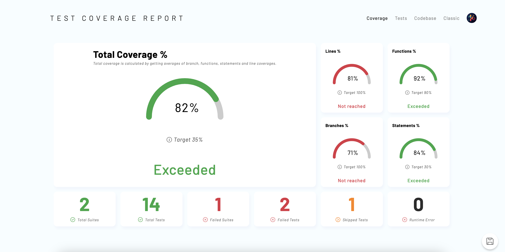
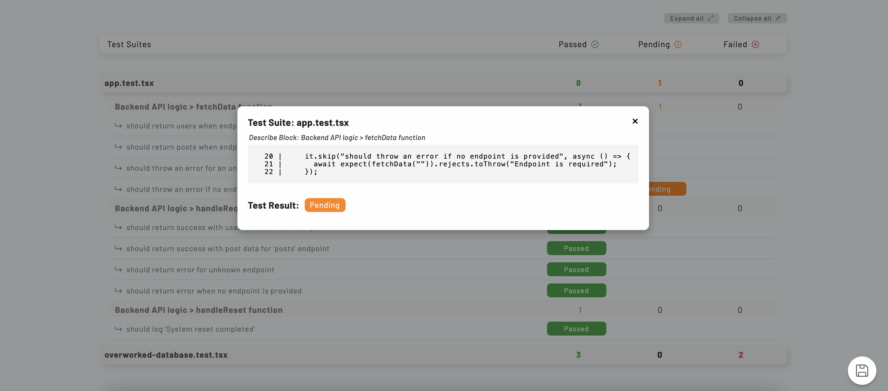
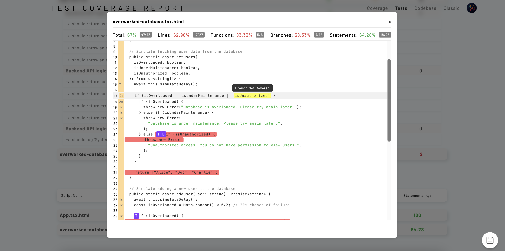

# **TDD Coverage Report**
_A custom Jest reporter for enhanced test coverage visualization in both **console** and **HTML reports**._

📊 **Beautifully formatted console output**  
📄 **Custom HTML test coverage report**  
✅ **Color-coded coverage thresholds**  
🖥️ **Floating UI controls for saving as PDF & expanding test sections**  

---

## **📄 HTML Report Preview**
### 📄 Main Page - Test Coverage Summary  
Shows the overall test coverage percentage and key metrics.  


### ✅ Test Cases - Passed & Failed Tests  
Displays detailed test results with expandable sections.  


### 📜 Script Coverage - Line & Branch Analysis  
Highlights uncovered lines and statements for better test coverage improvement.  


---

## **🚀 Installation**
You can install this package directly from **npm**:

```sh
npm install --save-dev tdd-coverage-report
```

or, install directly from **GitHub**:

```sh
npm install --save-dev github:klazapp/tdd-coverage-report
```

---

## **📌 Setup**
To enable the custom reporter in your **Jest configuration**, update `jest.config.js`:

```js
module.exports = {
  preset: "ts-jest",
  testEnvironment: "node", // or "jsdom"
  collectCoverage: true,
  coverageReporters: ["json", "lcov", "clover"],
  coverageDirectory: "./coverage",
  testMatch: ["**/__tests__/**/*.test.ts"], // Adjust this based on your test files

  reporters: [
    "default",
    [
      "tdd-coverage-report",
      {
        coverageTarget: {
          statements: 80,
          branches: 75,
          functions: 85,
          lines: 80,
          total: 80, // Global threshold
        },
        reportTitle: "Custom Test Coverage Report",
        enableDetailedLog: true,
      },
    ],
  ],
};
```

🔹 **The `coverageTarget` options allow you to specify custom coverage thresholds.**  
🔹 **These values will be used for color-coding the console and marking targets in the HTML report.**  

---

## **🛠️ Usage**
Run Jest with the custom reporter:

```sh
npm test
```

or

```sh
npx jest --coverage
```

Once the tests complete, your **custom HTML report** will be generated in the **project root**:

```
📄 tdd-coverage-report.html
```

---

## **🔍 Single-File Coverage with `coverageOne`**

Sometimes you want coverage **only** for a single test file and a single source file. Our package provides a CLI named **`coverageOne`** for that.

### A) Using `npx coverageOne`

If you installed `tdd-coverage-report` (which includes a `bin` entry), you can run:

```bash
npx coverageOne <testFile> <sourceFile>
```

For example:

```bash
npx coverageOne __tests__/service/authentication.service.test.ts service/authentication.service.ts
```

- The first parameter is the path to your **test** file.
- The second parameter is the path (or glob) for the **source** file you want to collect coverage from.

**What it does:**

1. Removes any existing `coverage/` folder.
2. Runs Jest on only that `<testFile>` with coverage.
3. Collects coverage only for `<sourceFile>`.
4. Generates a single HTML report named `tdd-coverage-report.html` (plus the normal JSON/LCOV coverage files) in the root.

> **Tip**: If you see “No tests found,” check your filename or path.  
> If you see "Jest did not exit one second after the test run," you likely have unclosed DB connections or timers. Use `jest --detectOpenHandles` in your test script to debug.

### B) Using an NPM Script

If you’d rather not type `npx`, define an npm script in your project’s `package.json`:

```jsonc
{
  "scripts": {
    "coverageOne": "coverageOne"
  }
}
```

Now you can do:

```bash
npm run coverageOne -- __tests__/service/authentication.service.test.ts service/authentication.service.ts
```

It’s the same underlying command, but invoked through `npm run coverageOne`.

Alternatively, you can be explicit in referencing the file inside `node_modules`:

```jsonc
{
  "scripts": {
    "coverageOne": "node node_modules/tdd-coverage-report/bin/coverageOne.cjs"
  }
}
```

Then:

```bash
npm run coverageOne -- <testFile> <sourceFile>
```

will achieve the same result, just without relying on an auto-created `coverageOne` binary in `.bin`.

---

## **📊 Features**
✅ **Custom Console Table**  
- Color-coded pass/fail coverage results in the terminal  
- Nicely formatted two-line table layout  
- Auto-wraps long file names  

✅ **Custom HTML Coverage Report**  
- **Visual test summaries** with expandable test cases  
- **Full script coverage details**, highlighting uncovered lines  
- **Clickable floating UI controls** for exporting as PDF  

✅ **Dynamic Coverage Targets**  
- Uses **default thresholds** unless overridden via Jest config  
- Applies **red/yellow/green** coloring based on these thresholds  

---

## **🎨 Console Output Example**
```
📊 File-Level Coverage 

 File Name                      | Statements      | Branches      | Functions      | Lines         
--------------------------------|-----------------|---------------|----------------|--------------
 src/utils/calc.ts              | 100.00% (10/10) | 75.00% (3/4)  | 100.00% (5/5)  | 90.00% (9/10)  
 src/utils/calc.ts (continued)  |                 |               |                |              
 src/api/index.ts               | 85.00% (17/20)  | 90.00% (9/10) | 95.00% (19/20) | 88.00% (22/25)  
 src/api/index.ts (continued)   |                 |               |                |              
```

✅ **Green** = Meets or exceeds coverage target  
⚠️ **Yellow** = Almost meeting the threshold  
❌ **Red** = Below the threshold  

---

## **📄 HTML Report Preview**
When the tests finish, open the **generated HTML report**:

```sh
open tdd-coverage-report.html
```

or manually open it in your browser.

---

## **📜 License**
This project is licensed under the **MIT License**.

---

## **🙌 Contributing**
If you’d like to contribute:
1. Fork the repository
2. Create a new branch (`feature/new-feature`)
3. Commit your changes
4. Push to your branch
5. Open a pull request 🚀

---

## **📞 Support**
For issues or feature requests, [open an issue](https://github.com/klazapp/tdd-coverage-report/issues).


